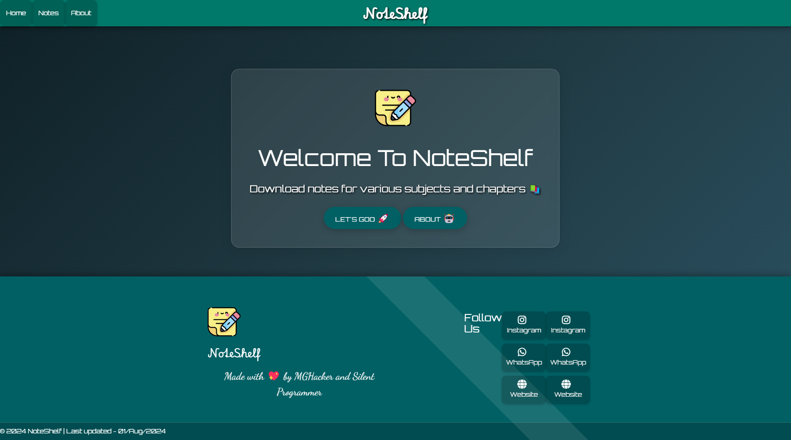
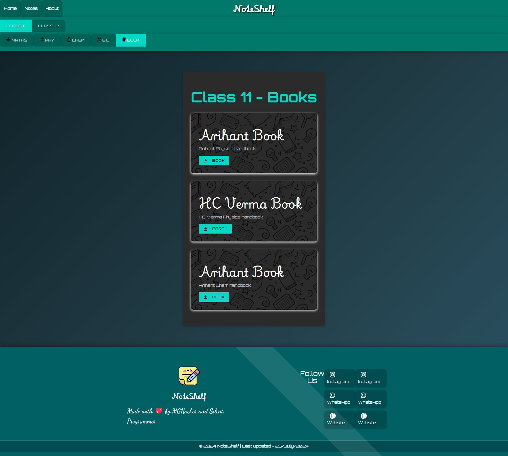
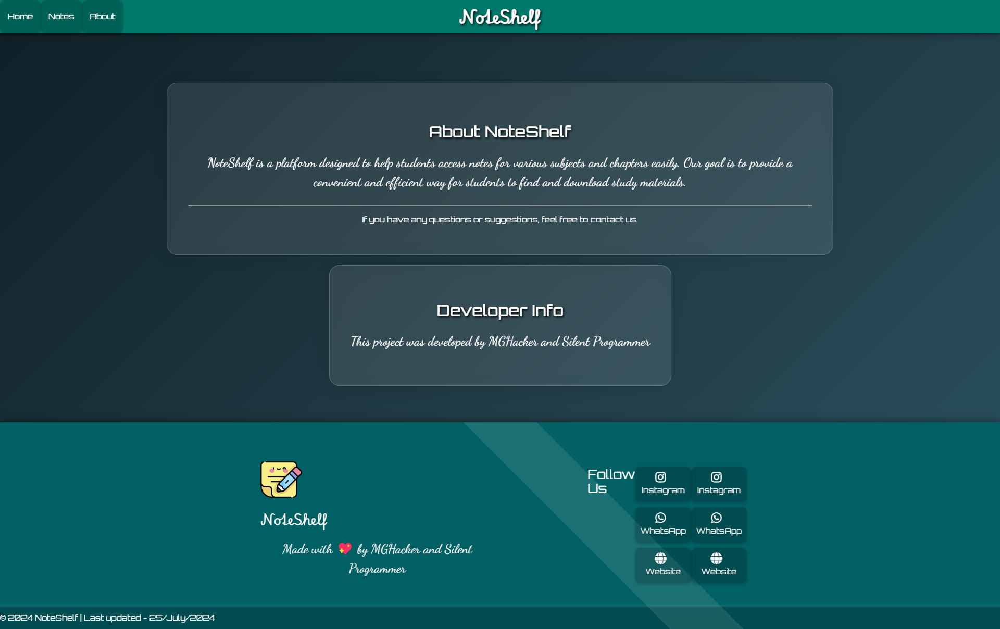

# Notes Downloader

Welcome to the Notes Downloader website! This web application allows users to download notes easily and efficiently. The website features a futuristic, advanced, and attractive design to enhance user experience.

## Features

- Download notes for various subjects.
- Futuristic and attractive UI design.
- Responsive design for all devices.
- Animation effects for a professional look.
- Easy navigation through classes and subjects.
- Developer info card included.

## Preview

4. **Open the App**:
    Open your browser and go to `https://noteshelf-2024.netlify.app/`.

## Usage

- Navigate through the classes using the upper horizontal navbar.
- Select a subject from the lower horizontal navbar.
- Download the notes by clicking on the download button next to the desired note.

## Technologies Used

- HTML
- CSS
- JavaScript

## Contributing

Contributions are welcome! If you have any suggestions or improvements, please create a pull request or open an issue.

## License

This project is licensed under the MIT License. See the [LICENSE](LICENSE) file for more details.

---

Thank you for using the Notes Downloader website! We hope it helps you in your studies and note-taking process.
